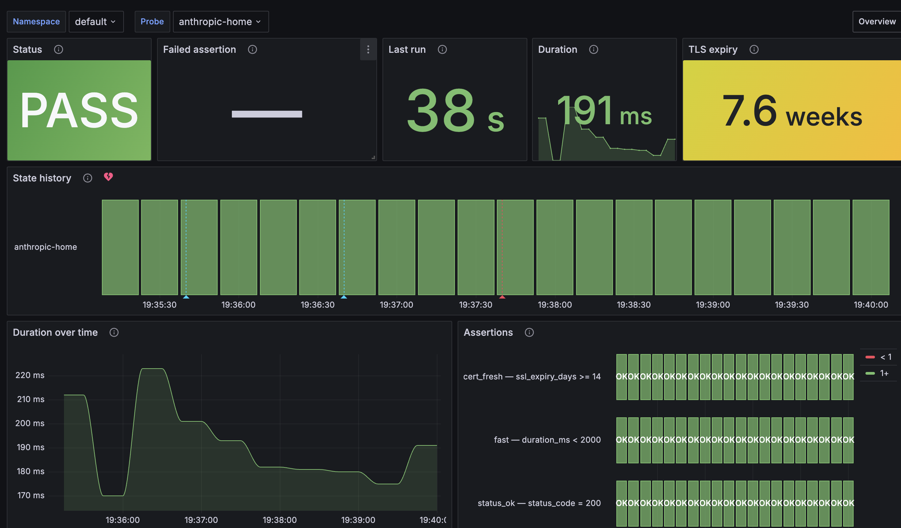
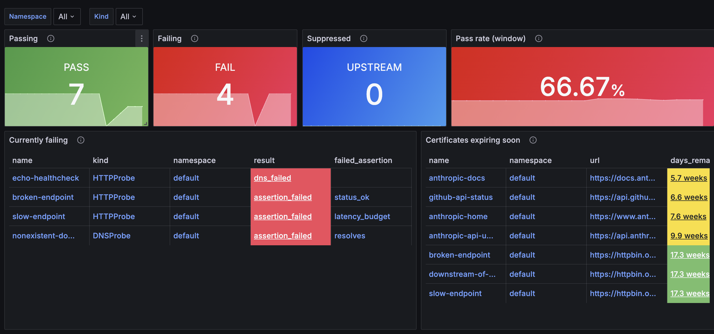

# synthetics-operator

Declarative synthetic monitoring for Kubernetes. Define HTTP checks, DNS probes, Playwright browser flows, and k6 load tests as CRDs; get Prometheus metrics and Grafana dashboards without wiring any of it yourself.

A self-hosted alternative to BetterStack / Datadog Synthetics — in-cluster, no SaaS, no per-seat pricing, no proprietary query language.

```yaml
apiVersion: synthetics.dev/v1alpha1
kind: HTTPProbe
metadata:
  name: api-health
spec:
  interval: 30s
  request:
    url: https://api.example.com/health
  assertions:
    - name: status_ok
      expr: status_code = 200
    - name: fast
      expr: duration_ms < 500
    - name: cert_fresh
      expr: ssl_expiry_days >= 14
```

→ scraped as:

```
synthetics_probe{name="api-health",kind="HTTPProbe"}              1
synthetics_probe_duration_ms{name="api-health"}                   142
synthetics_probe_assertion_result{name="api-health",assertion="status_ok"}  1
```

→ and rendered on the shipped **Synthetics / HTTP** dashboard:



Plus a fleet-level **Overview** — failing probes, upstream-attributed suppressions, cert expiry at a glance:



## Features

- **Unified** — HTTP, DNS, TLS, Playwright, k6 under one API
- **Opinionated** — curated runtimes (Playwright for browser, k6 for load); no arbitrary scripts
- **Prometheus-native** — `/metrics` endpoint, importable Grafana dashboards, shipped PrometheusRule + Grafana alert sets
- **Self-contained** — runs entirely in-cluster, no data egress, no SaaS component
- **Dependency-aware** — declare `depends` on other probes; downstream failures are silenced when an upstream is known to be failing (transitive, with loop detection)
- **Horizontally scalable** — probe execution lives in its own deployment behind a NATS work queue; add replicas for throughput

## Install

Requires Kubernetes **1.33+** (native sidecar containers for CronJob-backed tests).

```sh
helm install synthetics-operator \
  oci://ghcr.io/loks0n/charts/synthetics-operator \
  --version <release> \
  --namespace synthetics-system --create-namespace \
  --set nats.enabled=true
```

Every image (controller, webhook, prober, metrics, test-sidecar, k6-runner, playwright-runner) defaults to the chart's AppVersion — no image pinning flags needed for a straight install. Override individually with `--set controller.image.ref=…` etc. if you need custom builds.

`nats.enabled=true` spins up a single-node NATS alongside the operator. For production, point `nats.externalUrl` at an existing NATS cluster you manage.

## CRDs

| Kind | Runs via | For |
|---|---|---|
| `HTTPProbe` | in-cluster prober | HTTP checks, assertions, TLS expiry |
| `DNSProbe` | in-cluster prober | DNS resolution, answer inspection |
| `PlaywrightTest` | Kubernetes CronJob | Scripted browser flows (multi-step journeys) |
| `K6Test` | Kubernetes CronJob | Load and performance testing |

Ready-to-apply specs in [`examples/`](examples/). Full schema, assertion grammar, and dependency semantics in [`docs/design.md`](docs/design.md).

## Observability

### Dashboards

Five Grafana dashboards ship in [`dashboards/`](dashboards/). Drop them into a ConfigMap with the `grafana_dashboard=1` label and Grafana's sidecar picks them up:

- **Synthetics / Overview** — fleet state, cert expiry, suppressions
- **Synthetics / HTTP** — per-HTTPProbe: phase breakdown, assertions, TLS, status codes
- **Synthetics / DNS** — per-DNSProbe: response time, answer drift
- **Synthetics / Playwright** — per-test status, per-case pass/fail ribbons, durations
- **Synthetics / K6** — per-test status, duration trend

The Overview's table rows data-link straight into the right per-kind dashboard with the probe name pre-selected.

### Alerts

Two prebuilt rule sets, one per popular stack:

- **Prometheus Operator** — [`alerts/synthetics-rules.yaml`](alerts/synthetics-rules.yaml) (`PrometheusRule` CRD; covers probe-down, sustained-failure, cert-expiring, slow, config-error)
- **Grafana alerting** — [`hack/grafana-alert-rules.yaml`](hack/grafana-alert-rules.yaml) (ConfigMap, sidecar-provisioned)

### Metric vocabulary

The main signals are `synthetics_probe` and `synthetics_test` (0/1 health gauges). Classification lives on companion info metrics (`_result_info`) joined by `(name, namespace, kind)`. Full catalog in [`docs/design.md § Metrics Schema`](docs/design.md).

## Local development

```sh
make tools         # install golangci-lint, ko, setup-envtest under ./bin
make dev           # kind cluster + Tilt: operator + NATS + Prometheus + Grafana
make test          # unit tests
make test-envtest  # envtest suite (envtest binaries via setup-envtest)
make lint          # golangci-lint
make helm-lint     # chart lint
```

`make dev` gives you a full live-reload environment:

- Tilt UI — http://localhost:10350
- Grafana — http://localhost:3000 (admin / admin)
- Prometheus — http://localhost:9090
- Operator `/metrics` — http://localhost:8080/metrics

Apply anything in `examples/` against the dev cluster and watch the dashboards light up.

Contribution workflow, code structure, and shipping details are in [`CONTRIBUTING.md`](CONTRIBUTING.md).

## Status

Alpha — used in development, not yet battle-tested at production scale. The phase roadmap and design rationale live in [`docs/design.md`](docs/design.md).

## Design

For everything that shaped the operator — why NATS, why OTel-over-Prometheus, the split across controller / webhook / prober / metrics deployments, the dependency graph, the assertion grammar, metric cardinality budgets — see [`docs/design.md`](docs/design.md).
